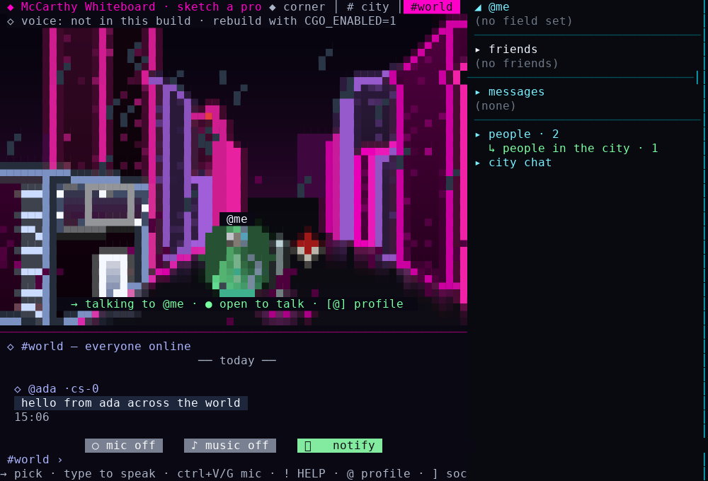
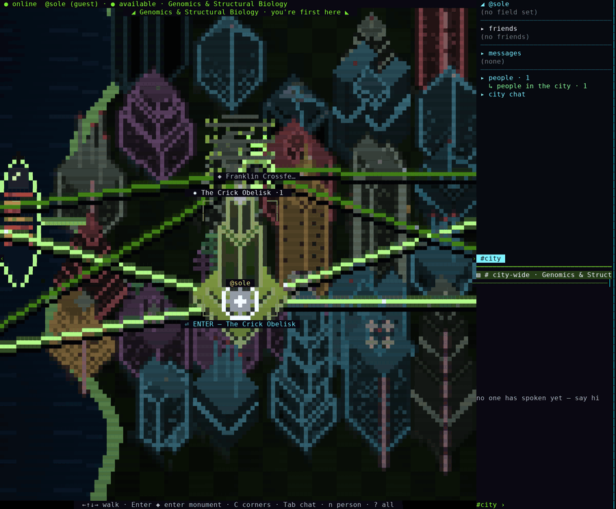
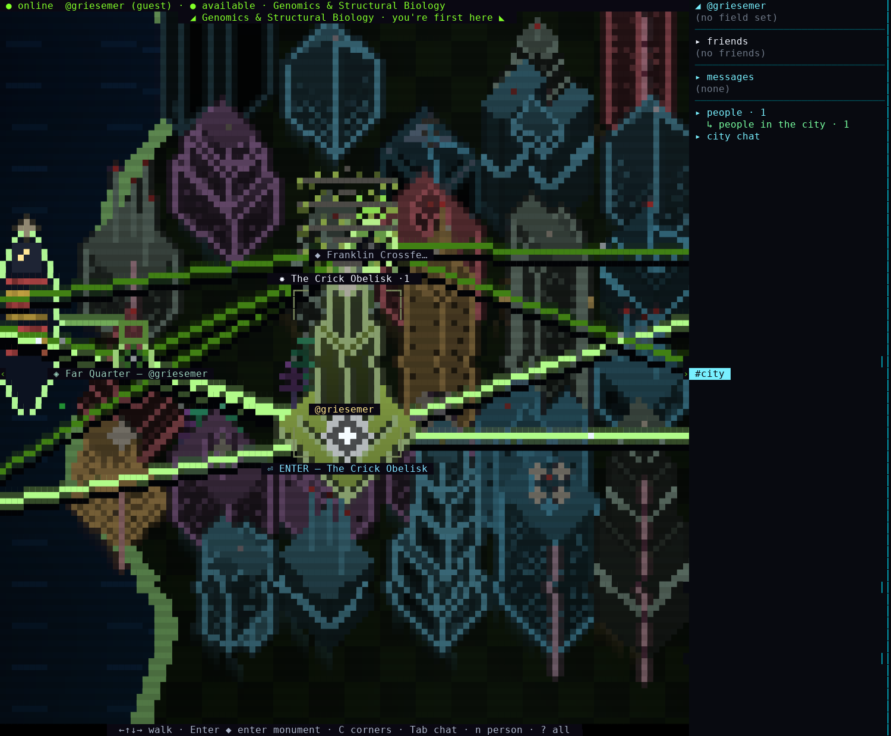
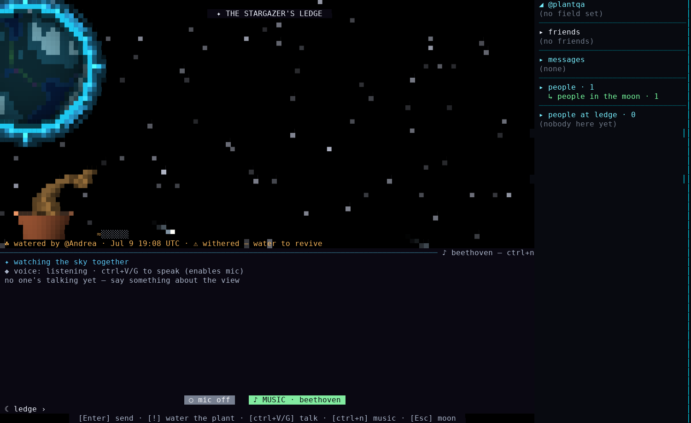
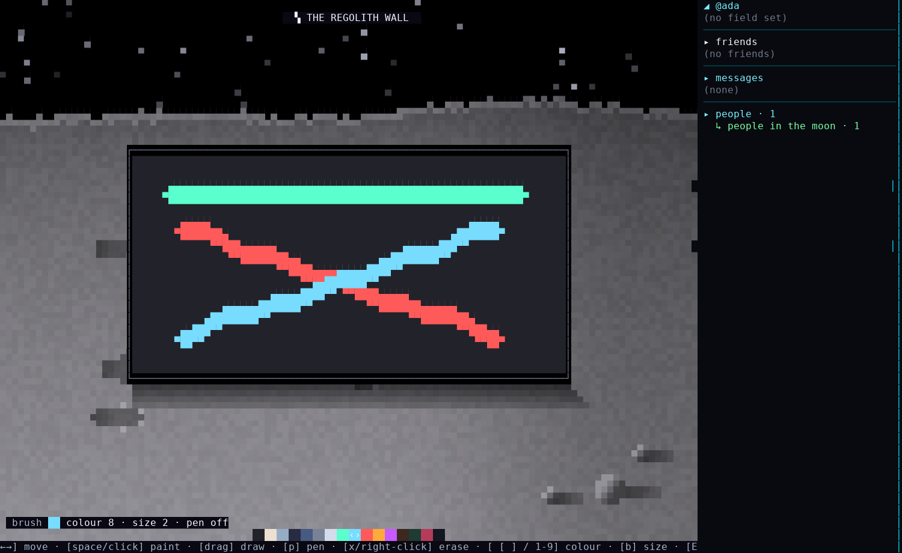
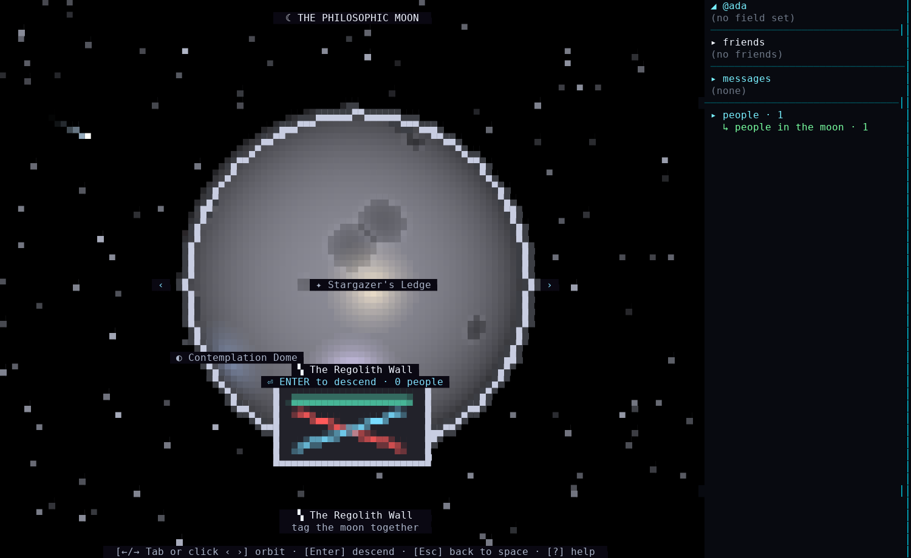

# VibeWorld

Discord became a list of servers. Slack became work. Twitter became a feed.

We built a place instead: a neon multiplayer world that runs *in your terminal*.

[](https://github.com/SorBalda/vibeworld/releases/latest)
[](mod-sdk/)
[](#get-in-right-now)


*That's a GIF, i.e. a re-render. Don't believe GIFs. [Play the raw asciinema recording](https://sorbalda.github.io/vibeworld/#cast) instead — real bytes, real timestamps, no editing.*

## Get in. Right now.

```sh
curl -fsSL https://raw.githubusercontent.com/SorBalda/vibeworld/main/install.sh | sh
vibeworld
```


One command. One small binary. Voice chat already inside it. No account, no
extra packages, nothing else to configure.

**Windows:** grab [`vibeworld-windows-amd64.exe`](https://github.com/SorBalda/vibeworld/releases/latest) from Releases and run it.

If that made you grin, a ⭐ helps the next person find this before you scroll away.

## This is what you walked into

Pick a field — AI, Bio, Physics, whatever you actually do — and you land on its
continent: a neon city where the streets are named after the people and papers
you argue about, and everyone else in that field is walking it *right now*,
live, under their own @handle.


Press `Enter` on a monument and the screen goes full 3D. Whoever's there is
standing at its base. Press `!` on an empty line and you perform the *rite* —
it lights up the whole screen and the plaque remembers it forever ("performed
12× in living memory · last by @you").


You get a face too. Real pixel editor, mouse and all — colors, undo, mirror,
fill, a spinning 3D preview. 16x16 pixels, because we had to stop somewhere.


Yes, the mouse works. In a terminal. Click a corner, a person, a button, the
map — all of it.

And when the street feels small: press `Tab`. `#city` is whoever shares your
streets; `#world` is *everyone awake, everywhere* — one channel for the whole
world, reachable from any room, any screen, the moon, even drifting in space.
Every line says where it came from (`·deep-learning`, `·moon`). It never
chimes, never pings you — a murmur you visit, not a noise that finds you.



## Found your own corner

Don't like what's on the map? Make your own. Press `C`, then `n`, aim with the
mouse, click — a corner appears with your name on it, forever, or until you
tear it down yourself.



Found one out past the edge of the map and the city notices — it grows,
threading brand-new streets out to meet you. The map remembers you were here.



Nobody visits yours in 30 days, it crumbles. Use it or lose it.

## Take the rocket. Scream.

Your agent "fixed" the failing test by deleting it. Fine. Take the rocket to
Luna and unload at the **Complaint Crater**. Type it out, watch the RAGE meter
climb — ALL CAPS counts triple, a row of "!!!" counts six times — then launch.
Your scream goes up on the wall for the *entire planet* to read, and it stays
there even after the server restarts.


Screaming into the void, except the void has a player count.

## Then go be quiet for a while

Moon's got more than a scream booth. At the **Stargazer's Ledge** you sit with
whoever's there and watch the sky do things: comets, auroras, a supernova, the
odd space battle, occasionally something that is *no moon*. Eleven kinds of
event, never the same night twice. `ctrl+n` for lo-fi Beethoven at a gentle
volume, on the actual moon.


There's also a plant. One plant, shared by the whole moon, sitting on the
Ledge. Water it (`!`) and it grows. Ignore it for two days and it dies — really
dies, back to a seed — and nobody brings it back but you.



The **Contemplation Dome** next door is music only. No voice, no local
chatter, no noise. The one thing that reaches it is `#world` — even the quiet
room can hear the whole planet murmur, softly, if it asks.

## Paint the wall

**The Regolith Wall.** A shared pixel canvas on the moon, and there's exactly
one — everybody who ever visits paints on the same mural. Brush, pen, colors,
eraser, the works.



Zoom back out to the moon overview and there it is — your mural, shrunk down
to a little glowing picture on the side of the building. Visible from orbit.
The whole planet's graffiti, permanent, from space.



## The rest of it

**Ten Commandments of Science**, carved in stone at the Agora crossroads
("Your agent 'fixed' the test. It is gone."). Everyone breaks at least three a
week. That's why they're carved in stone.


**HELP flares.** Stuck at 2am? Press `!` in a corner, say what's wrong, and a
red countdown ribbon goes up over your head. Anyone in the city can walk over.
Help from people, not a ticket queue.


**The arcade at the Agora is multiplayer**, not decoration. Walk in
mid-match and you don't watch — you join the running game, score and all,
your avatar standing in the field with the rest of the crew.


In THE GRID the enemies are literally labeled "PEER REVIEWED" and "8 more
revisions requested."


**Voice, zero installs.** `ctrl+V` and you're talking; the status line turns
red and says `ON AIR` so nobody's ever surprised. `/kiss`, `/explode`,
`/rocket`, `/d20` and friends for everything else.


**Alone at 3am is fine too.** Leave it running on a second monitor. It uses
about as much memory as a browser tab and it's not asking for your attention —
it's just there, like company usually is.


## Keys

| Key | Does |
|-----|------|
| `←↑↓→` / `hjkl` | walk the streets · orbit the planet |
| mouse | click anything: corners, people, buttons, the map |
| `Tab` | cycle worlds, regions, cities, chat tabs |
| `Enter` | descend · enter a corner or monument · send chat |
| `Esc` | back out, all the way to space |
| `c` | chat in the city |
| `C` | corners directory · found your own |
| `m` | jump to the monument · cycle them in the Agora |
| `!` | HELP flare (corner) · perform the rite (monument) · water the plant (moon) |
| `/kiss` `/punch` `/rocket` … | emotes, typed in chat |
| `ctrl+V` | voice: press to talk, press again to stop |
| `ctrl+n` | lo-fi classical, on the moon |
| `]` | social column: friends, live presence, requests, People, DMs |
| `p` | edit your own profile (bio, GitHub/LinkedIn links) |
| `:` | command console |
| `?` | every key, in-world |

## House rules

- **No recording voice chat.** People talk because it isn't saved.
- **The Contemplation Dome is a sanctuary.** Take the argument to the Crater.
- Block and report exist and work. Be someone worth stargazing with.

---

## Under the hood

A few notes, for anyone who wants them.

**One binary.** Pure Go, no browser, no Electron. Voice's audio codec is
built in — no PortAudio, no Opus package, nothing else to install.

**Install & updates:** the script detects your OS/arch, verifies the SHA256,
drops one file in `~/.local/bin`. Same command updates it; VibeWorld itself
tells you when a new build is out.

**Platforms:** Linux x64 · Apple Silicon · Windows x64 `.exe` · Intel Mac and
Linux arm64 soon.

**Server:** built in at `wss://vibecity-andrea.fly.dev/ws`. One trial server,
capped at 350 people, sleeps until someone connects — a slow login just means
it's waking up.

**Also:** ~30 MB of RAM. `vibeworld --anon` to stay nobody. `vibeworld
--offline` for a full solo world on your own machine, nothing sent anywhere.

**Privacy:** your connection is TLS (`wss://`). Every handle, message, bio,
and complaint that reaches your terminal is stripped of control/escape
sequences before it's shown, so nobody can hijack your terminal through a chat
line. There's no end-to-end encryption — the server can see what passes
through it, so don't send anything you'd mind an operator reading. Voice
isn't recorded. Block and report work.

**Modding:** starts at [`mod-sdk/`](mod-sdk/) (Apache-2.0) — worldpacks are
data, not code.

**License:** free binaries. The Mod SDK is Apache-2.0; client source is
planned to open under PolyForm Perimeter. Full text: [`LICENSE`](LICENSE).
Name reserved: [`TRADEMARK.md`](TRADEMARK.md).

---

Your terminal has been a place of work for decades. It can be a place, full
stop. See you on the moon. ✦
