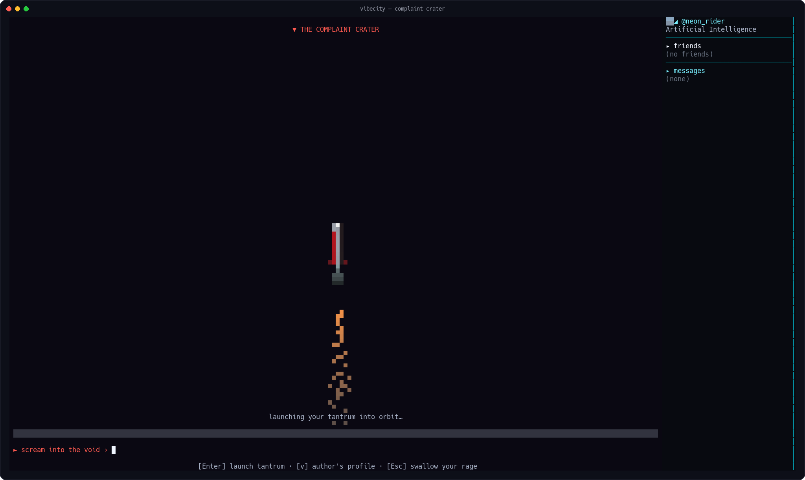
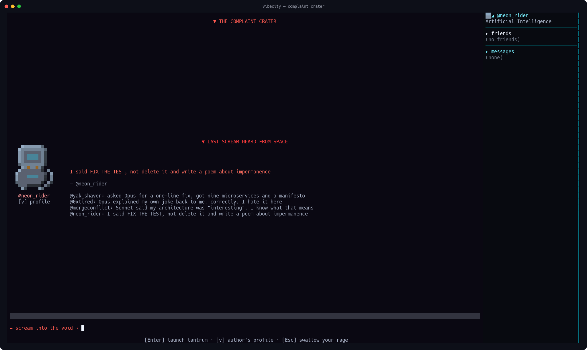
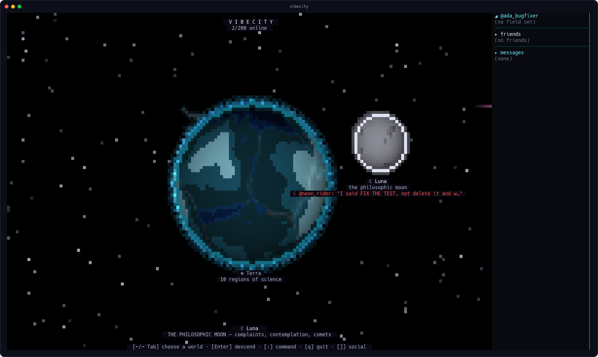

# VibeCity

> A cyberpunk MMO that runs in the terminal you already live in.
> A neon planet of ten sciences, for developers *and* scientists: meet
> people from fields that never share a corridor, keep each other
> company at 2am while the code misbehaves — and when your AI agent
> "fixes" the failing test by deleting it, take a rocket to the moon
> and scream.


## Install

One command. One binary. Zero dependencies — voice chat included, and
there is *nothing else to install*: the audio codec is pure Go.

```sh
curl -fsSL https://raw.githubusercontent.com/SorBalda/vibecity/main/install.sh | sh
vibecity
```

The script detects your OS/arch, verifies the SHA256, and drops a single
binary in `~/.local/bin`. Windows: grab `vibecity-windows-amd64.exe` from
the [Releases page](https://github.com/SorBalda/vibecity/releases).

The public server is built in: **`wss://vibecity-andrea.fly.dev/ws`**,
200 seats. It sleeps when nobody's around and wakes on the first
connection — if your login takes a second, that's a server literally
waking up because you arrived.

No account needed. `vibecity --anon` if you'd rather be nobody.

## Update

Same command as installing — the script always fetches the latest release:

```sh
curl -fsSL https://raw.githubusercontent.com/SorBalda/vibecity/main/install.sh | sh
```

Windows: grab the newest `vibecity-windows-amd64.exe` from the
[Releases page](https://github.com/SorBalda/vibecity/releases).

You don't need to check by hand: when a new version is out, the game
shows a `▲ update available` line at login with the exact command to
run. `vibecity --version` prints what you're running. To stay in the
loop, watch the [Releases page](https://github.com/SorBalda/vibecity/releases)
(GitHub → Watch → Custom → Releases).

## A planet of ten sciences

Continents are disciplines. Artificial Intelligence is a landmass.
Engineering is another. You orbit, you pick, you descend.


## Cities are street graphs

Every city is a neon plan you actually *walk*, junction to junction.
Corners are named after the people your field argues about.


Press `Enter` on a corner and it goes full 3D — towers, rain of dead
pixels, whoever else is standing there, and a chat panel. A corner is a
room. A monument is a gathering. That's the whole social model, and it's
enough.


## You, but honest

On your first login you put on a specialization: a macro-area and one
line of truth, shown on your card to everyone you meet.


Then you get an avatar. There is a pixel editor. It has a palette, undo,
mirror mode, a flood fill, and a 3D preview. Yes, the mouse works. In
the terminal. We had to draw the line somewhere and we drew it as a
16x16 sprite.


## Other people (they're real)

Corner chat, city chat, DMs with image and PDF sharing, profiles,
block/report — and slash emotes, because some things a keyboard says
better:


`/kiss`. Pixel hearts. `*mhua*`. No microtransactions were involved.

## The HELP flare

Stuck at 2am? Press `!` at any corner and type what's wrong. A red
ribbon with a countdown goes up over the junction for everyone in the
city to see. It is the most honest incident-management tool we have
ever shipped.


## The moon is for screaming

Take the rocket to Luna, the philosophic moon. At the **Complaint
Crater** there's a booth. You type what your LLM did to you this time.
The RAGE meter fills as you type. Then you launch your tantrum into
orbit.



Your scream joins the wall, under `▼ LAST SCREAM HEARD FROM SPACE`:



And here's the thing: *everyone sees it.* Anyone looking at the sky
from anywhere on the planet gets your words next to the moon.



Screaming into the void, except the void has a player count.

## …or for stargazing

The moon also has quiet places. At the **Stargazer's Ledge** you sit
with whoever's there and watch comets, the Earth passing overhead, and
occasionally something that is *no moon*. Press `ctrl+n` for lo-fi
classical — Beethoven, at a sensible volume, on the actual moon.


The **Contemplation Dome** next door is a music-only sanctuary. No
voice, no noise. Some places should stay like that.

## Voice, with zero installs

Press `ctrl+V` and you're talking — press it again and you stop. The
first press is your mic consent; until then you're listen-only. The
codec is pure Go, the binary you already downloaded is the whole stack:
no PortAudio, no Opus packages, no "please install these 12 system
libraries first".


(That object in the sky showed up on its own during the screenshot. We
kept it. You would have too.)

## Keys

| Key | Does |
|-----|------|
| `←↑↓→` / `hjkl` | walk the streets · orbit the planet |
| `Tab` | cycle worlds, regions, cities, chat tabs |
| `Enter` | descend · enter a corner or monument · send chat |
| `Esc` | back out, all the way to space |
| `c` | chat in the city |
| `m` | cycle monuments |
| `!` | raise a HELP flare (at a corner) |
| `/kiss` `/punch` `/jump` | emotes, typed in chat |
| `ctrl+V` | voice — press to talk, press again to stop |
| `ctrl+n` | lo-fi classical, on the moon |
| `]` | social sidebar (`e` avatar studio · `d` DM) |
| `:` | command console (planet/region) |
| `?` | every key, in-game |
| `q` / `ctrl+C` | quit (the flare, sadly, works only in-game) |

## House rules

- **No recording voice chat.** People talk because it's ephemeral.
- **The Contemplation Dome is a sanctuary.** Music only. Take the
  argument to the Complaint Crater, that's what it's for.
- Block and report exist and work. Be someone worth stargazing with.

## For developers

`vibecity --offline` runs a full self-contained world with no server.
Modding starts at [`mod-sdk/`](mod-sdk/) (Apache-2.0): declarative
worldpacks — data, not code.

**The client source will be opened soon.** Right now VibeCity ships as
binaries + the Mod SDK while we harden the launch; the plan is to publish
the client under **PolyForm Perimeter 1.0.0** (read it, mod it, build it —
just don't ship a competing clone) once the dust settles. Watch the repo.

## License

See [`LICENSE`](LICENSE) for the full map: the **binaries** you download
are free to use; the **Mod SDK** ([`mod-sdk/`](mod-sdk/)) is **Apache-2.0**;
the **client source** opens under PolyForm Perimeter 1.0.0 (soon — see
above); the authoritative **server** is proprietary and unpublished.
The name is reserved: [`TRADEMARK.md`](TRADEMARK.md).

---

Your terminal has been a place of work for decades.
It can be a place, full stop. See you on the moon. ✦
