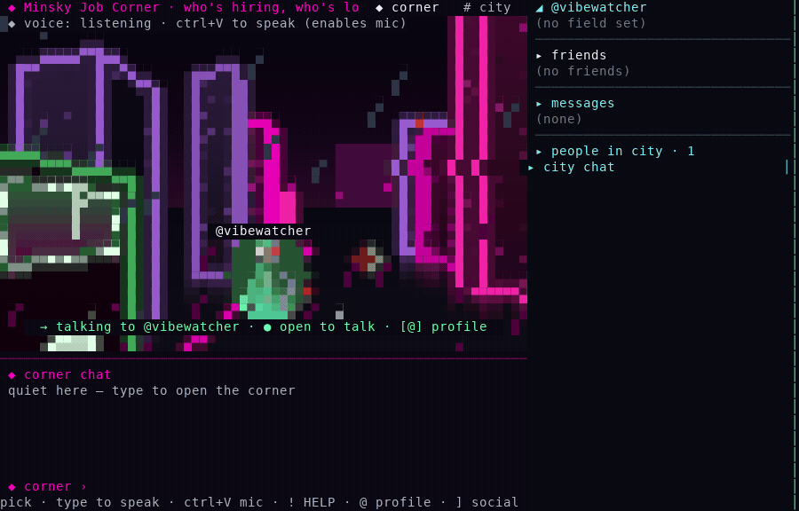
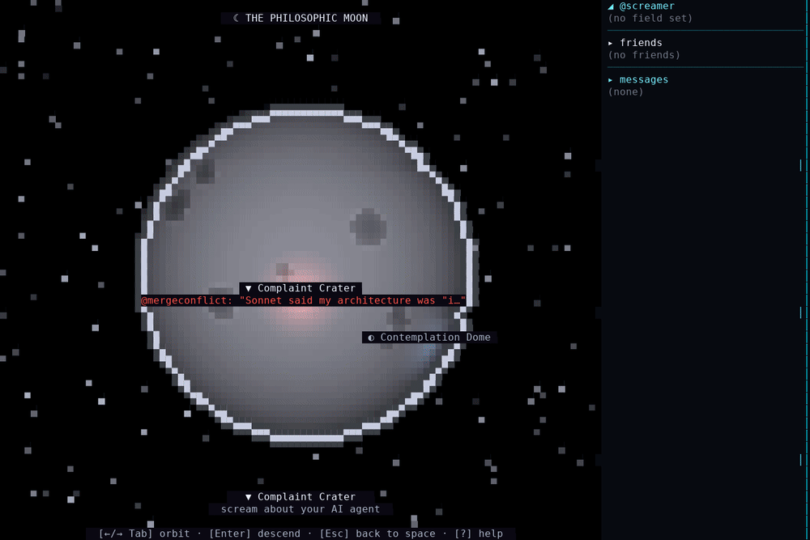
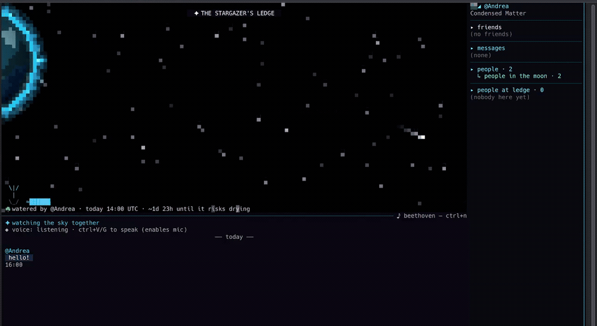

# VibeWorld

**Install & run** — one command, one binary, zero dependencies (voice chat included):

```sh
curl -fsSL https://raw.githubusercontent.com/SorBalda/vibeworld/main/install.sh | sh
vibeworld
```

**Windows:** download [`vibeworld-windows-amd64.exe`](https://github.com/SorBalda/vibeworld/releases/latest) from Releases, then run `vibeworld`.

> A neon planet of nine continents. Eight sciences orbit the Agora, the
> crossroads at the center, and you walk a terminal map of your own field,
> meeting other devs at street corners named after the people and papers you
> argue about. Keep each other company at 2am while the code misbehaves. And
> when your AI agent "fixes" the failing test by deleting it, take a rocket to
> the moon and scream.

Discord became a list of servers.\
Slack became work.\
Social media became feeds.

**We wanted a place.**

**▶ See it, then install it:** [the landing site](https://sorbalda.github.io/vibeworld/) · [one-line install](#install) · [Releases](https://github.com/SorBalda/vibeworld/releases)

So we built one: a shared world that runs in your terminal. Not a metaphor: a
multiplayer TUI, a cyberpunk neon-lit planet you walk street by street. No
browser, no Electron, one pure-Go binary. Then it starts doing things terminals
aren't supposed to do. Voice chat with zero extra installs (the codec ships
inside the binary). A pixel-art avatar editor with a palette, undo, and a mouse
that actually works, in the terminal. A rocket to the moon, where you type what
your LLM did to you this time and launch the scream into orbit, and everyone on
the planet reads it in the sky right next to the moon.

A planet, not another server list. Come with friends and claim a street corner,
or show up alone at 3am and watch comets from a ledge on the moon. It holds up
either way. Installing it just to look at it is a valid use case.


Leave it running on a second monitor while you actually work — the whole world
sips **about 30 MB of RAM** (a single browser tab eats more). It isn't asking
for your attention. It's just there, the way a window is.


## Install

One command. One binary. Zero dependencies, voice chat included, and there is
*nothing else to install*: the audio codec is pure Go.

```sh
curl -fsSL https://raw.githubusercontent.com/SorBalda/vibeworld/main/install.sh | sh
vibeworld
```

The script detects your OS/arch, verifies the SHA256, and drops a single binary
in `~/.local/bin`. Windows: grab `vibeworld-windows-amd64.exe` from the
[Releases page](https://github.com/SorBalda/vibeworld/releases). Linux and Apple
Silicon (M-series) Macs are supported today; **Intel Mac support is coming
soon**.

**Updating** is the same command: the script always fetches the latest release
(on Windows, grab the newest `.exe` from Releases). You don't need to check by
hand. When a new version is out, vibeworld shows a `▲ update available` line at
login with the exact command to run, and `vibeworld --version` prints what
you're running. To stay in the loop, watch the Releases page (GitHub → Watch →
Custom → Releases).

The public server is built in: **`wss://vibecity-andrea.fly.dev/ws`**. VibeWorld
is early: one trial server, capped at 350 online at once, and it sleeps when
nobody's around and wakes on the first connection. If your login takes a second,
that's the server booting because you showed up. That's a feature, not a crowd;
an empty world shouldn't run up an idle cloud bill. Some nights it *will* be
quiet, and that's fine. The world's still live and there's plenty to do with no
one else online (see *Fine on your own, too*).

No account needed. `vibeworld --anon` if you'd rather be nobody.

## You, but honest

Nobody here is "passionate about technology". On first login you put on a
specialization: a macro-area and one line of truth, shown on your card to
everyone you meet.


Met someone whose 2am takes you want to keep? Your card can carry a **GitHub
and/or LinkedIn link** (`p` to edit your own profile), and anyone who likes
talking to you can press `g`/`l` on your card to open them, behind a two-step
confirm, never a one-key surprise click.

Then, that first time only, you get an avatar. There is a pixel editor. It has a
palette, undo, mirror mode, a flood fill, and a 3D preview. Yes, the mouse
works. In the terminal. (It works everywhere else, too: click a corner, a
person, a button, the map. Hit-testing is wired through the whole UI, not just
here.) We had to draw the line somewhere and we drew it as a 16x16 sprite. Come
back later and you land straight on the globe, no re-onboarding.


## A planet of nine sciences and a crossroads

Log in and you're floating between Terra and Luna. Pick a direction and you're
in it. Continents are disciplines. Artificial Intelligence is a landmass.
Engineering is another. The Agora sits at the center, the crossroads everyone
orbits. You orbit, you pick, you descend.


## Cities are street graphs

Your field already has famous corners: the people and papers everyone argues
about. Here they're literal streets, a neon plan you *walk* junction to
junction.


A corner is a room; a monument is a gathering. Press `Enter` on one and it goes
full 3D: towers, rain of dead pixels, whoever else is standing there, and a
chat panel. Walk up and you're in it.


Want to leave a mark that outlives the scroll? Every landmark keeps a **rite**:
press `!` on an empty chat line inside a monument and the landmark wakes in a
full-screen blaze, and the plaque remembers ("rite performed 12× in living
memory · last by @you"). A junction's chat is disposable traffic; a monument's
transcript is its engraving.

## The Ten Commandments of Science

In the Agora, the crossroads at the center of the world, stands the Tablet of
the **Ten Commandments of Science** ("Your agent 'fixed' the test. It is
gone."):


They're engraved at the crossroads of the world because every discipline walks
past them on the way to its own continent. You've broken at least three this
week. Nobody follows them. That's why they're carved in stone.

## The Stands

Also at the Agora: **The Stands**, the shared bulletin. Post a phrase or drop a
PDF, and like what resonates — the good ones stick around, liked and stacked, so
the crossroads keeps a memory of what the world found worth saying.


## The HELP flare

Stuck on a bug at 2am? Step into a corner, hit `!`, and say what's wrong: a red
ribbon with a countdown goes up over your junction, and anyone in the city sees
it and can walk over. On-call for people, not pagers.



## The moon

Some nights you need to scream. Some nights you need the sky. Take the rocket
to Luna, the philosophic moon: it does both, and they're opposites.

**Screaming.** At the **Complaint Crater** there's a booth. You type what your
LLM did to you this time; the RAGE meter fills as you go, and it has opinions.
SHOUTING counts triple, a barrage of "???" counts sixfold, so real fury pins the
meter to full long before a calm paragraph would. Then you launch your tantrum
into orbit. Your scream joins the wall under `▼ LAST SCREAM HEARD FROM SPACE`,
and *everyone sees it*: anyone looking up from anywhere on the planet gets your
words next to the moon, and they survive server restarts. Screaming into the
void, except the void has a player count.



**Stargazing.** The moon also has quiet places. At the **Stargazer's Ledge** you
sit with whoever's there and watch the sky run its own show: comets, auroras, a
supernova, the Earth passing overhead, the occasional ship battle, and every so
often something that is *no moon*. Eleven kinds of event, seed-shuffled so no
two nights look alike, and synced across everyone at the Ledge so you're all
watching the same thing. Press `ctrl+n` for lo-fi classical (Beethoven, at a
sensible volume, on the actual moon). The **Contemplation Dome** next door is a
music-only sanctuary: no voice, no noise. Some places should stay like that.



## Other people

Some things a keyboard says better. Corner chat, city chat, DMs that carry
images and PDFs, profiles, block/report, and slash emotes:


`/kiss`. Pixel hearts. `*mhua*`. No microtransactions were involved. (There's a
whole set: `/punch`, `/jump`, `/rocket`, `/explode`, `/dance`, `/facepalm`,
`/highfive`, `/coffee`, `/d20`.)

## Friends, and who's around

Wondering if your people are on? Press `]`: the social column shows your
friends live, a `●` when they're online plus where on the planet they're
standing, so you know whether to walk over or take the rocket up. Friend
requests survive time zones: send one to someone offline and it's delivered
when they next log in, and requests coming *your* way sit in a `⇄ REQUESTS`
row you accept or decline without leaving the column.

Finding one person in a ten-continent world shouldn't take a map and a prayer.
The same column has **People**: everyone online right now, each with where they
are. Type to search by handle, GitHub login, or field, then open a profile, DM
them, or send a friend request straight from the list.

## Voice, with zero installs

Some arguments are faster out loud. Press `ctrl+V` and you're talking; press it
again and you stop. The first press is your mic consent; until then you're
listen-only, and when your mic is actually live the status line turns **red**
and reads `ON AIR`, so you never wonder whether the world can hear you.
The binary you already downloaded is the whole stack (the codec is pure Go): no
PortAudio, no Opus packages, no "please install these 12 system libraries
first".


(That object in the sky showed up on its own during the screenshot. We kept it.
You would have too.)

## The arcade at the crossroads

Sometimes the fix is shooting something. Two of the Agora's monuments are lying
about being monuments. Step into **The Arena** and you're in **THE GRID**: a first-person neon corridor shooter where
the gun is the git blame cannon, a magazine is 24 commits, reloading runs
`git commit -am "reload"`, and the wave 5 boss is THE AGENT THAT DELETED YOUR
TESTS. Step into **The Pulvinar** and it's **GLITCH COLLECTOR**: hold the
firewall, squash the glitches before they chew through it. The Agora's other
two Works are at least honest about what they are: feed **The Furnace** and its
CORE TEMP climbs while it prints a receipt for what you burned; give **The
Crowd** a voice and the ROAR meter barely twitches for one person, then pegs in
a beat for a full house.

The point: **the games are multiplayer.** Walk in while someone's
already playing and you don't watch, you *join the running match*, mid-wave,
score and all. The other players are standing in the game with their own
avatars and @handles: pixel busts on the Glitch playfield, full 3D billboards
in the corridors of THE GRID. A CREW row keeps the tally, and whoever started
the match holds the restart key. Press `R` as a guest and the game tells you
exactly whose match you walked into.


No quarters. The cabinet at the center of the world runs on karma.


## Fine on your own, too

It's 3am and nobody you know is awake. Fine. Leave VibeWorld open on a second
monitor, go sit in a room, watch the sky from the Ledge, or read the last
scream heard from space. The planet, the moon, the beacons, the wall:
the world itself is company. This isn't `--offline`. You're still on the real
server, it's just that some nights it's quiet. Someone tends to wander in
eventually.


## Keys

| Key | Does |
|-----|------|
| `←↑↓→` / `hjkl` | walk the streets · orbit the planet |
| mouse | click anything: corners, people, buttons, the map. works across the whole UI |
| `Tab` | cycle worlds, regions, cities, chat tabs |
| `Enter` | descend · enter a corner or monument · send chat |
| `Esc` | back out, all the way to space |
| `c` | chat in the city |
| `m` | cycle monuments |
| `!` | raise a HELP flare (in a corner) · perform the rite (at a monument) |
| `/kiss` `/punch` `/rocket` … | emotes, typed in chat |
| `ctrl+V` | voice: press to talk, press again to stop |
| `ctrl+n` | lo-fi classical, on the moon |
| `]` | social column: friends, live presence, requests, People, DMs |
| `p` | edit your own profile (bio, GitHub/LinkedIn links) |
| `:` | command console (`/profile` · `/logout` · `/quit`) |
| `?` | every key, in-world |
| `q` / `ctrl+C` | quit (the HELP flare, sadly, only works in-world) |

## House rules

- **No recording voice chat.** People talk because it's ephemeral.
- **The Contemplation Dome is a sanctuary.** Music only. Take the argument to the
  Complaint Crater, that's what it's for.
- Block and report exist and work. Be someone worth stargazing with.

## Privacy & safety

Plain facts, no marketing. Your connection is TLS (`wss://`). Every handle,
message, bio, shared filename, HELP line, and complaint that reaches your
terminal is stripped of control and escape sequences before it renders, so a
hostile peer or server can't hijack your terminal through a chat line
(`internal/textsafe`, applied on both ends). What we *don't* do: there is no
end-to-end encryption. The server relays your text, DMs, shared images/PDFs, and
voice, and can see all of it, so don't send anything you'd mind a server
operator reading. Voice isn't recorded (it's ephemeral by design; see *House
rules*), but it isn't E2E-encrypted either. Block and report exist and work.

## For developers

Modding starts at [`mod-sdk/`](mod-sdk/) (Apache-2.0): declarative worldpacks,
data instead of code.

## License

VibeWorld ships as **free binaries**. The **Mod SDK** ([`mod-sdk/`](mod-sdk/))
is **Apache-2.0**; the client source is planned to open under **PolyForm
Perimeter**. And **`vibeworld --offline`** runs a full self-contained world
with no server at all, nothing phoned home.

Full text: [`LICENSE`](LICENSE). The name is reserved: [`TRADEMARK.md`](TRADEMARK.md).

---

Your terminal has been a place of work for decades. It can be a place, full
stop. See you on the moon. ✦
