# VibeWorld

A neon multiplayer world that runs in your terminal — one pure-Go binary, voice chat baked in, and a moon you fly to and scream at when the agent deletes your tests.

[](https://github.com/SorBalda/vibeworld/releases/latest)
[](mod-sdk/)
[](#install)


*GIFs are rendered video. Want proof it's a real terminal? [Play the raw asciinema recording](https://sorbalda.github.io/vibeworld/#cast) — timestamped bytes, not a re-render.*

> A neon planet of nine continents. Eight sciences orbit the Agora, the
> crossroads at the center, and you walk a terminal map of your own field,
> meeting other devs at street corners named after the people and papers you
> argue about. Keep each other company at 2am while the code misbehaves. And
> when your AI agent "fixes" the failing test by deleting it, take a rocket to
> the moon and scream.

Discord became a list of servers.\
Slack became work.\
Social media became feeds.

**We wanted a place.**

So we built one: a shared world in your terminal. Not a metaphor — a multiplayer
TUI, a cyberpunk neon-lit planet you walk street by street. No browser, no
Electron, one pure-Go binary. Then it does things terminals aren't supposed to:
voice chat with the codec baked in, a pixel-art avatar editor with a mouse that
actually works, a rocket to the moon where you type what your LLM did this time
and launch the scream into orbit for the whole planet to read in the sky.

You don't join it the way you join a server; you show up and walk around. Come
with friends and claim a street corner, or land alone at 3am and watch comets
from a ledge — it holds up either way. Installing it just to look at it is a
valid use case.

**▶ [See it on the landing site](https://sorbalda.github.io/vibeworld/)** · **[Download a release](https://github.com/SorBalda/vibeworld/releases)**

**Jump to:** [Install](#install) · [The planet](#a-planet-of-eight-sciences-and-a-crossroads) · [Cities](#cities-are-street-graphs) · [The moon](#the-moon) · [The arcade](#the-arcade-at-the-crossroads) · [Keys](#keys) · [Privacy](#privacy--safety) · [License](#license)

## Install

```sh
curl -fsSL https://raw.githubusercontent.com/SorBalda/vibeworld/main/install.sh | sh
vibeworld
```

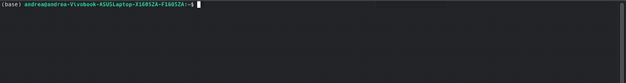

One command, one binary, zero dependencies — voice chat included, because the
audio codec is pure Go and ships *inside* the binary. The script detects your
OS/arch, verifies the SHA256, and drops a single binary in `~/.local/bin`.

**Windows:** download [`vibeworld-windows-amd64.exe`](https://github.com/SorBalda/vibeworld/releases/latest) from Releases, then run `vibeworld`.

Platforms: Linux x64/arm64 ✓ · Apple Silicon ✓ · Windows x64 `.exe` ✓ · **Intel Mac soon**.

**Updating** is the same command — it always fetches the latest release, and at
login vibeworld shows a `▲ update available` line with exactly what to run.

The public server is built in: **`wss://vibecity-andrea.fly.dev/ws`**. It's early
— one trial server, capped at 350 online, asleep until someone connects. If your
login takes a second, that's the server booting because you showed up: that's a
feature, not a crowd, since an empty world shouldn't run up an idle cloud bill.

No account needed. `vibeworld --anon` if you'd rather be nobody.

If this made you smile, a ⭐ helps the next person find it.

## You, but honest

Nobody here is "passionate about technology". On first login you put on a
specialization: a macro-area and one line of truth, shown on your card to
everyone you meet.

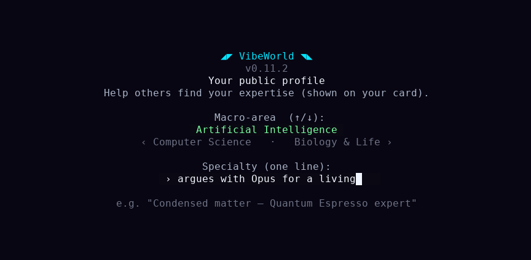

Met someone whose 2am takes you want to keep? Your card can carry a **GitHub
and/or LinkedIn link** (`p` to edit your profile), and anyone can press `g`/`l`
to open them — behind a two-step confirm, never a one-key surprise click.

Then, that first time only, you get an avatar. There's a real pixel editor:
palette, undo, mirror mode, flood fill, a 3D preview. We had to draw the line
somewhere and we drew it as a 16x16 sprite.

Yes, the mouse works. In the terminal. And not just in the editor — click a
corner, a person, a button, the map; hit-testing is wired through the whole UI.
Come back later and you land straight on the globe, no re-onboarding.

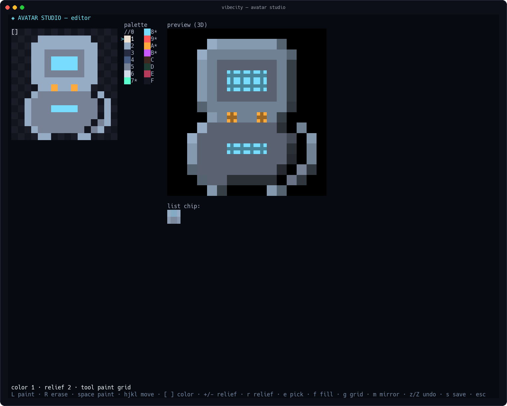

## A planet of eight sciences and a crossroads

Log in and you're floating between Terra and Luna. Pick a direction and you're in
it. Continents are disciplines — Artificial Intelligence is a landmass,
Engineering is another, eight sciences ringing the world. The Agora, the
crossroads at the center of the world, sits where all of them meet. You orbit,
you pick, you descend.

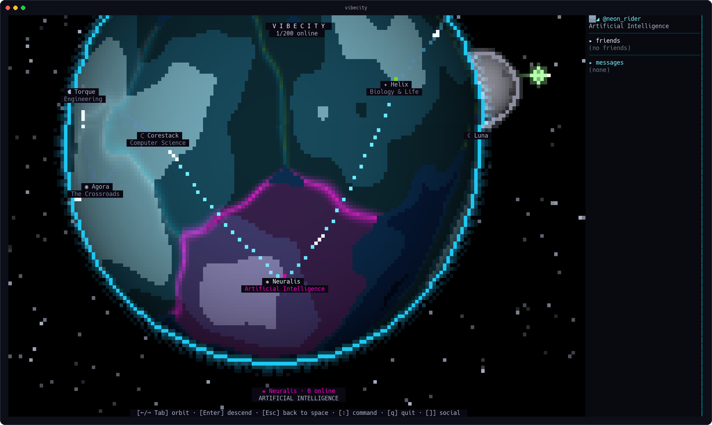 — *animated version on the [site](https://sorbalda.github.io/vibeworld/)*

## Cities are street graphs

Your field already has famous corners: the people and papers everyone argues
about. Here they're literal streets, a neon plan you *walk* junction to
junction.

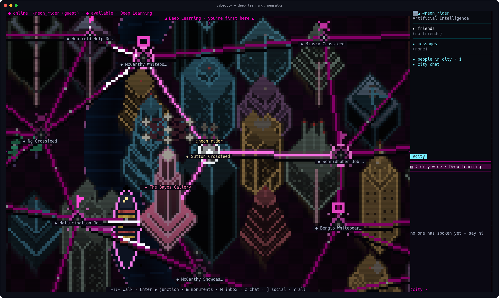

And the streets are live: everyone in the city is on the same map at the same
moment, walking corner to corner, each under their own @handle.

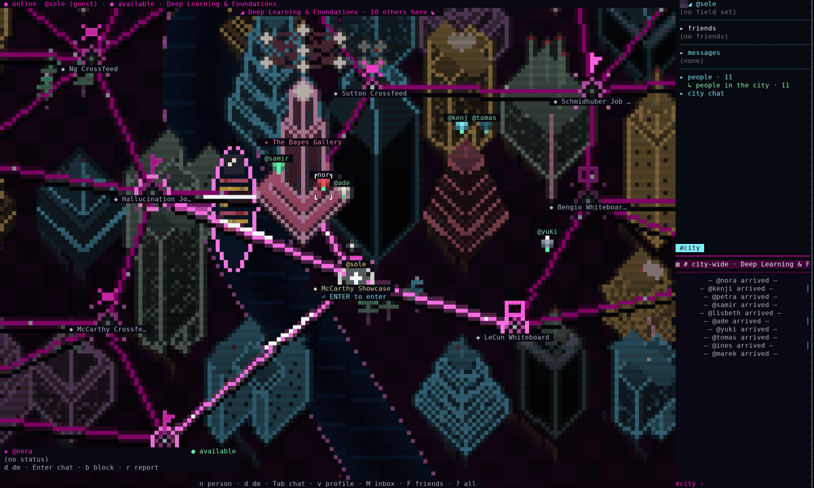

A corner is a room; a monument is a gathering. Press `Enter` on one and it goes
full 3D: towers, rain of dead pixels, whoever else is standing there, a chat
panel. Walk up and you're in it.

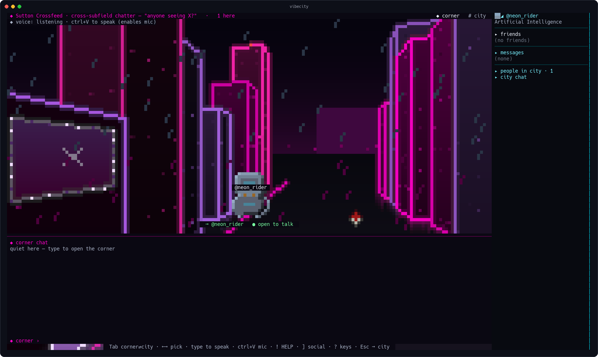

Want to leave a mark that outlives the scroll? Every landmark keeps a **rite**:
press `!` on an empty chat line inside a monument and it wakes in a full-screen
blaze, and the plaque remembers ("rite performed 12× in living memory · last by
@you"). A junction's chat is disposable traffic; a monument's transcript is its
engraving.

## The Ten Commandments of Science

In the Agora stands the Tablet of the **Ten Commandments of Science** ("Your
agent 'fixed' the test. It is gone."):

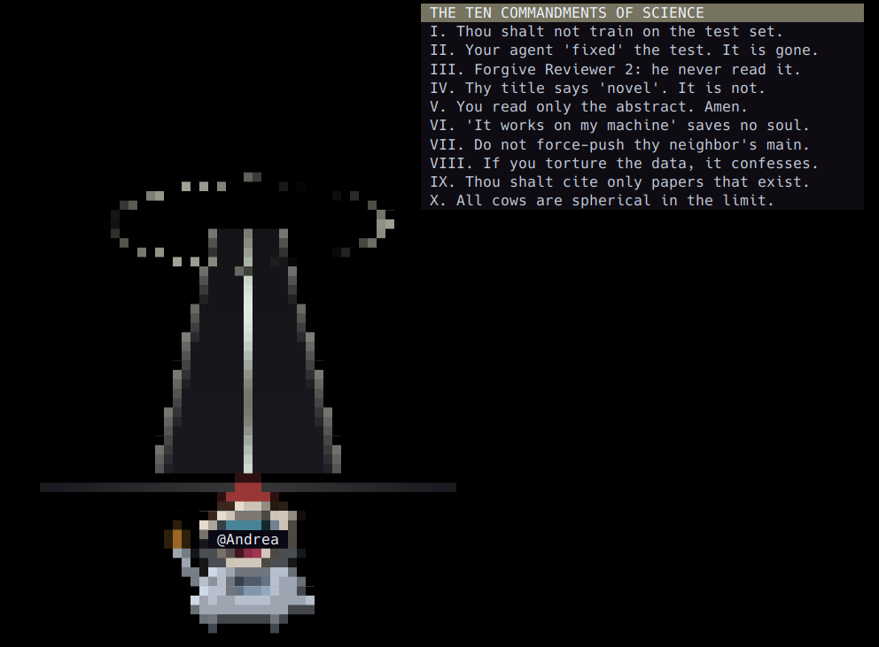

They're engraved at the crossroads because every discipline walks past them on
the way to its own continent. You've broken at least three this week. Nobody
follows them. That's why they're carved in stone.

## The Stands

Also at the Agora: **The Stands**, the shared bulletin. Post a phrase or drop a
PDF, and like what resonates — the good ones stick around, liked and stacked, so
the crossroads keeps a memory of what the world found worth saying.

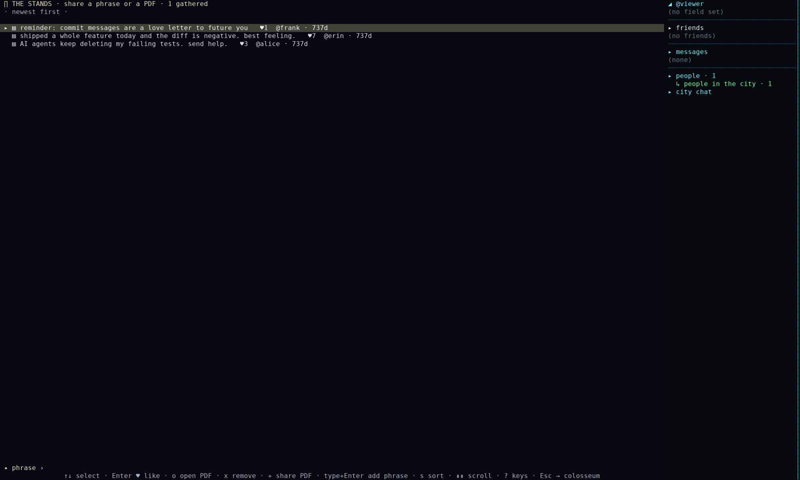

## The HELP flare

Stuck on a bug at 2am? Step into a corner, hit `!`, and say what's wrong: a red
ribbon with a countdown goes up over your junction, and anyone in the city can
walk over. On-call for people, not pagers.

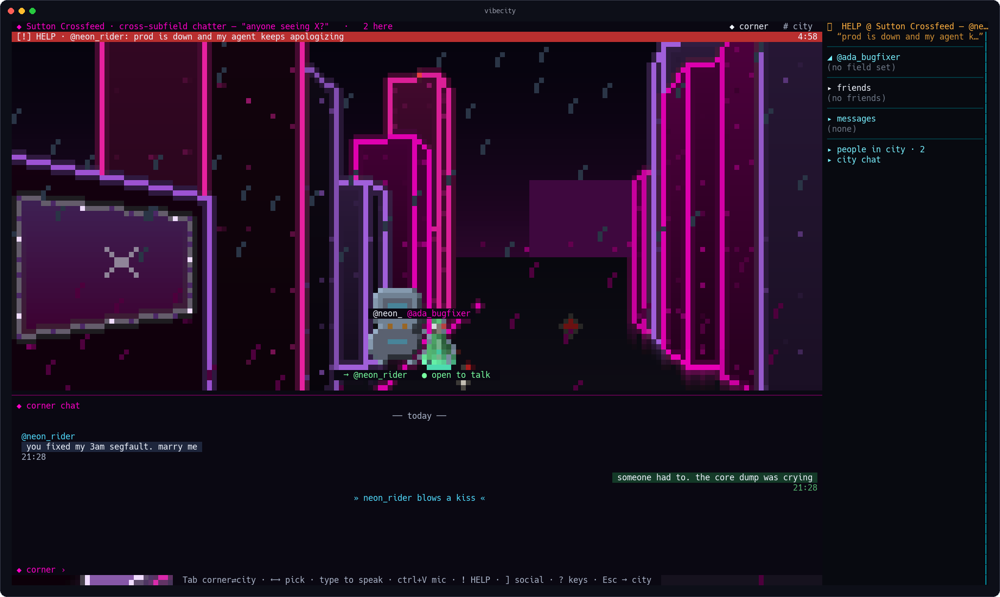 — *animated version on the [site](https://sorbalda.github.io/vibeworld/)*

## The moon

Some nights you need to scream. Some nights you need the sky. Take the rocket
to Luna, the philosophic moon: it does both, and they're opposites.

**Screaming.** At the **Complaint Crater** there's a booth. You type what your
LLM did to you this time; the RAGE meter fills as you go, and it has opinions —
SHOUTING counts triple, a barrage of "???" counts sixfold, so real fury pins the
meter long before a calm paragraph would. Then you launch your tantrum into
orbit: it joins the wall under `▼ LAST SCREAM HEARD FROM SPACE`, and *everyone
sees it* — anyone looking up from anywhere on the planet gets your words next to
the moon, and they survive server restarts. Screaming into the void, except the
void has a player count.

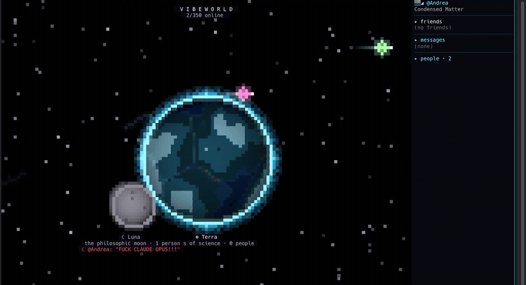

**Stargazing.** The moon also has quiet places. At the **Stargazer's Ledge** you
sit with whoever's there and watch the sky run its own show: comets, auroras, a
supernova, the Earth passing overhead, the occasional ship battle, and every so
often something that is *no moon*. Eleven kinds of event, seed-shuffled so no
two nights look alike, and synced across everyone at the Ledge. Press `ctrl+n`
for lo-fi classical (Beethoven, at a sensible volume, on the actual moon). The
**Contemplation Dome** next door is a music-only sanctuary: no voice, no noise.
Some places should stay like that.

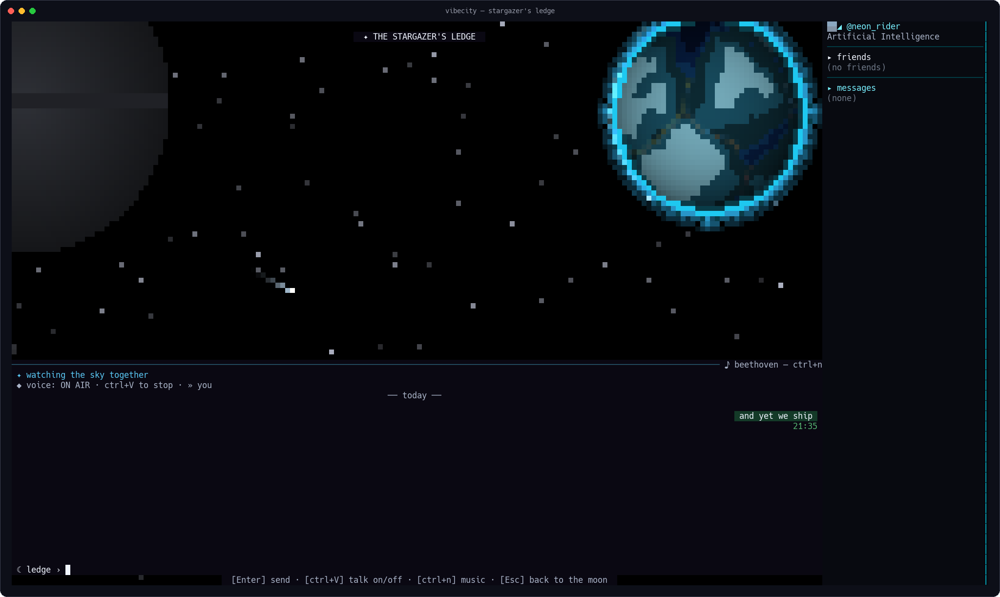 — *animated version on the [site](https://sorbalda.github.io/vibeworld/)*

## Other people

Some things a keyboard says better. Corner chat, city chat, DMs that carry
images and PDFs, profiles, block/report, and slash emotes:

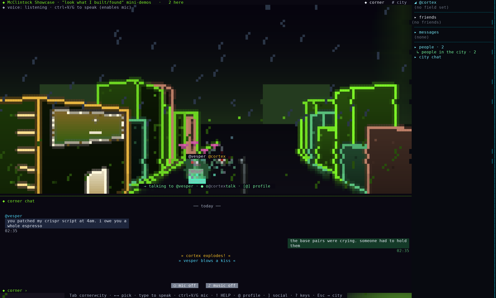

`/kiss`. Pixel hearts. `*mhua*`. No microtransactions were involved. (There's a
whole set: `/punch`, `/jump`, `/rocket`, `/explode`, `/dance`, `/facepalm`,
`/highfive`, `/coffee`, `/d20`.)

## Friends, and who's around

Wondering if your people are on? Press `]`: the social column shows your friends
live, a `●` when they're online and where on the planet they're standing, so you
know whether to walk over or take the rocket up. Friend requests survive time
zones — send one to someone offline and it lands at their next login, and
requests coming *your* way wait in a `⇄ REQUESTS` row you accept or decline in
place.

Finding one person in a nine-continent world shouldn't take a map and a prayer.
The same column has **People**: everyone online right now, each with where they
are. Search by handle, GitHub login, or field, then open a profile, DM, or add
them straight from the list.

## Voice, with zero installs

Some arguments are faster out loud. Press `ctrl+V` and you're talking; press it
again and you stop. The first press is your mic consent; until then you're
listen-only, and when your mic is live the status line turns **red** and reads
`ON AIR`, so you never wonder whether the world can hear you. The binary you
already downloaded is the whole stack (the codec is pure Go): no PortAudio, no
Opus packages, no "please install these 12 system libraries first".

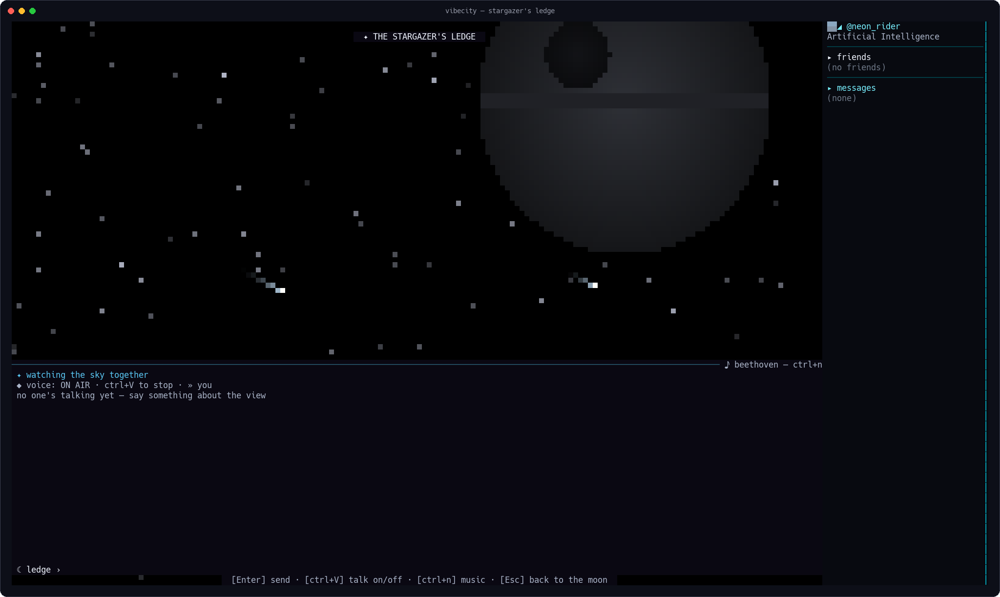

(That object in the sky showed up on its own during the screenshot. We kept it.
You would have too.)

## The arcade at the crossroads

Sometimes the fix is shooting something. Two of the Agora's monuments are lying
about being monuments. Step into **The Arena** and you're in **THE GRID**: a
first-person neon corridor shooter where the gun is the git blame cannon, a
magazine is 24 commits, reloading runs `git commit -am "reload"`, and the wave 5
boss is THE AGENT THAT DELETED YOUR TESTS. Step into **The Pulvinar** for
**GLITCH COLLECTOR**: hold the firewall, squash the glitches before they chew
through it. The other two Works are honest — **The Furnace** prints a receipt for
whatever you burn, and **The Crowd**'s ROAR meter barely twitches for one voice,
then pegs for a full house.

The point: **the games are multiplayer.** Walk in while someone's already
playing and you don't watch, you *join the running match*, mid-wave, score and
all. The others stand in the game with their own avatars and @handles — pixel
busts on the Glitch playfield, full 3D billboards in the corridors of THE GRID. A
CREW row keeps the tally, and whoever started the match holds the restart key;
press `R` as a guest and the game tells you exactly whose match you walked into.

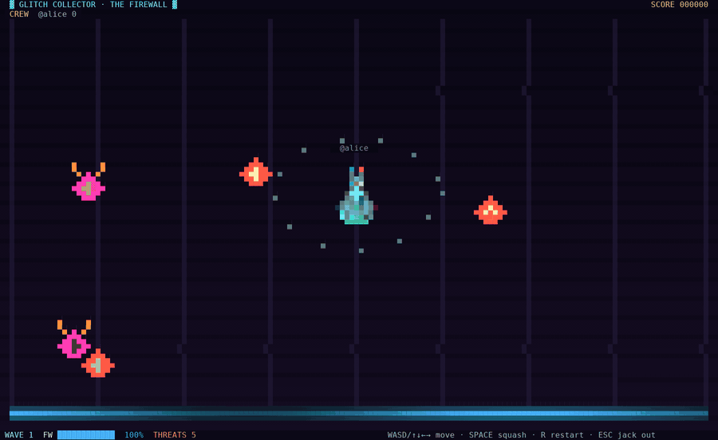

No quarters. The cabinet at the center of the world runs on karma.

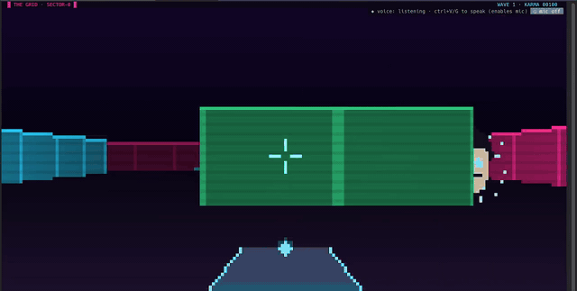

## Fine on your own, too

It's 3am and nobody you know is awake. Fine. Leave VibeWorld open on a second
monitor while you actually work — the whole world sips **about 30 MB of RAM** (a
single browser tab eats more). It isn't asking for your attention; it's just
there, the way a window is.

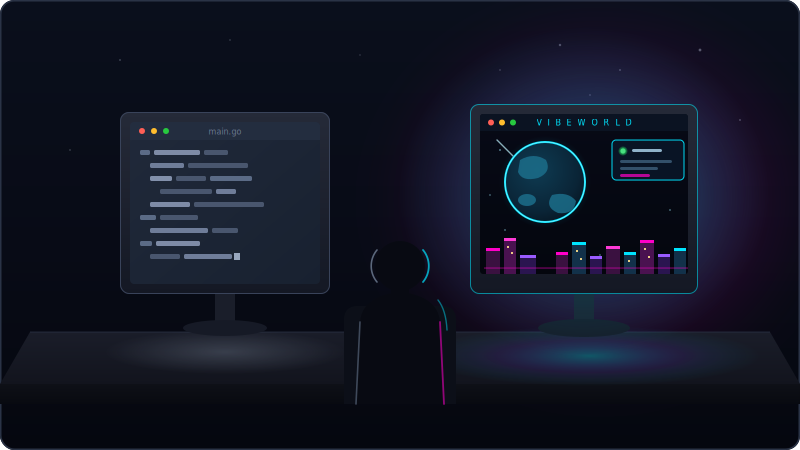

Go sit in a room, watch the sky from the Ledge, or read the last scream heard
from space. The planet, the moon, the beacons, the wall — the world itself is
company. This isn't `--offline`; you're on the real server, some nights just
quiet. Someone tends to wander in eventually.

And "quiet" doesn't mean "nothing to do". Alone, on any given night, you can:
walk a continent you've never visited and read street signs named after papers
you've argued about; try the day's Oracle riddle (it's genuinely hard); honour
a monument and leave your mark on its plaque; proclaim a finding at The Stands
for whoever comes next; water the plant on the Ledge before it wilts; clear a
few waves in the arcade; scream at the moon and watch your words orbit the
planet. The multiplayer is the soul, but the world is built to be *walked* —
if you like terminals at all, exploring it solo is the point, not the fallback.

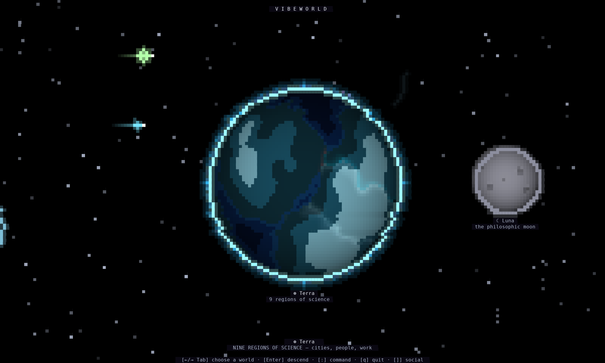

## Keys

| Key | Does |
|-----|------|
| `←↑↓→` / `hjkl` | walk the streets · orbit the planet |
| mouse | click anything: corners, people, buttons, the map. works across the whole UI |
| `Tab` | cycle worlds, regions, cities, chat tabs |
| `Enter` | descend · enter a corner or monument · send chat |
| `Esc` | back out, all the way to space |
| `c` | chat in the city |
| `m` | cycle monuments |
| `!` | raise a HELP flare (in a corner) · perform the rite (at a monument) |
| `/kiss` `/punch` `/rocket` … | emotes, typed in chat |
| `ctrl+V` | voice: press to talk, press again to stop |
| `ctrl+n` | lo-fi classical, on the moon |
| `]` | social column: friends, live presence, requests, People, DMs |
| `p` | edit your own profile (bio, GitHub/LinkedIn links) |
| `:` | command console (`/profile` · `/logout` · `/quit`) |
| `?` | every key, in-world |
| `q` / `ctrl+C` | quit (the HELP flare, sadly, only works in-world) |

## House rules

- **No recording voice chat.** People talk because it's ephemeral.
- **The Contemplation Dome is a sanctuary.** Music only. Take the argument to the
  Complaint Crater, that's what it's for.
- Block and report exist and work. Be someone worth stargazing with.

## Privacy & safety

Plain facts, no marketing. Your connection is TLS (`wss://`). Every handle,
message, bio, filename, HELP line, and complaint that reaches your terminal is
stripped of control and escape sequences before it renders, so a hostile peer or
server can't hijack your terminal through a chat line (`internal/textsafe`, both
ends). What we *don't* do: there's no end-to-end encryption. The server relays
your text, DMs, files, and voice and can see all of it, so don't send anything
you'd mind a server operator reading. Voice isn't recorded (ephemeral by design;
see *House rules*) but isn't E2E either. Block and report exist and work.

## For developers

Modding starts at [`mod-sdk/`](mod-sdk/) (Apache-2.0): declarative worldpacks,
data instead of code.

## License

VibeWorld ships as **free binaries**. The **Mod SDK** ([`mod-sdk/`](mod-sdk/))
is **Apache-2.0**; the client source is planned to open under **PolyForm
Perimeter**. And **`vibeworld --offline`** runs a full self-contained world
with no server at all, nothing phoned home.

Full text: [`LICENSE`](LICENSE). The name is reserved: [`TRADEMARK.md`](TRADEMARK.md).

---

Your terminal has been a place of work for decades. It can be a place, full
stop. See you on the moon. ✦
